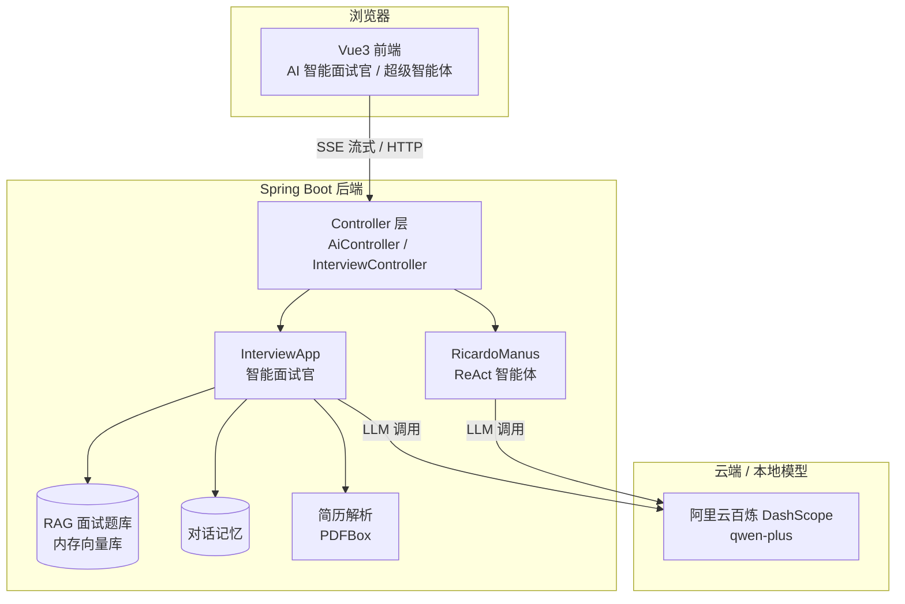

# AI 智能面试官

> 一位会"边想边查"的 AI 面试官：基于 **ReAct 模式 + RAG 知识库 + 简历解析**，把你的简历变成一场真实的 Java 后端模拟面试。

## 🎯 项目简介

`ricardo-ai-agent` 是一个基于 Spring Boot 3 + Spring AI 的 AI 智能体应用。它以 **AI 智能面试官**为核心场景：上传简历后，面试官会围绕你的项目经历层层深挖，并在回答过程中**实时展示"思考 → 检索 → 组织回答"的完整思考链**。

项目还内置了一个基于 ReAct 的 AI 超级智能体，作为多步推理与工具编排的示例。

## ✨ 核心功能亮点

- 🧠 **ReAct 真思考链** — 后端真实检索知识库，通过 SSE 实时推送 `thought` / `text` / `done` 三类事件，前端把"思考 → 检索 → 组织"全流程可视化。检索是**真的**（真实命中条数），不是动画。
- 📄 **简历 PDF 解析** — 上传即读（PDFBox 抽取文本），面试官自动围绕简历中的项目经历逐层追问。
- 🔒 **隐私防护** — 简历原文只进内存、只喂给模型，**不进日志、不进 SSE 事件**；思考链只汇报"命中 N 条"；对话日志默认保持 INFO 级别，密钥永不打印。
- 📚 **RAG 面试题库** — 内置 Java 基础与并发、Spring 与 MySQL/Redis、微服务与分布式三大主题题库，回答时自动检索增强。
- ⚙️ **CI/CD** — GitHub Actions 自动跑后端测试 + 前端构建，全程零真实 API 消耗。

## 🛠 技术栈

| 分类 | 技术 |
|---|---|
| **后端框架** | Spring Boot 3.4.4 · Spring AI 1.0.0 · Spring AI Alibaba 1.0.0.2 |
| **AI 模型** | 阿里云百炼 DashScope（qwen-plus）· Ollama（gemma3，可选本地模型） |
| **向量库** | SimpleVectorStore（内存向量库，启动时自动装载题库，**无需外部数据库**） |
| **文档处理** | PDFBox（简历解析）· MarkdownDocumentReader（题库装载） |
| **前端** | Vue 3 · Vite · Vue Router · Axios · SSE（Server-Sent Events） |
| **工程化** | JDK 21 · Maven · Docker Compose · Nginx · GitHub Actions · dotenv-java |

## 🏗 架构图



**思考链事件协议**（一根 SSE 流内用 JSON 的 `type` 字段区分事件类型）：

```jsonc
{"type": "thought", "content": "正在检索知识库… 命中 3 条"}  // 思考步骤 → 思考链面板
{"type": "text",    "content": "关于 JVM 内存模型…"}          // 正式回答 → 聊天气泡
{"type": "done",    "content": ""}                            // 结束信号
```

## 🚀 快速开始

### 环境要求

| 依赖 | 版本要求 | 说明 |
|---|---|---|
| JDK | **21** | 命令行与 IDE 均需指向 21 |
| Node.js | >= 18 | 前端构建 |
| Docker | 可选 | 想一键启动时用 |
| 阿里云百炼 API Key | 必需 | 用于对话与向量化 |

### 第一步：克隆项目

```bash
git clone https://github.com/YCYWJW/ricardo-ai-agent.git
cd ricardo-ai-agent
```

### 第二步：配置 .env（关键）

复制模板并填入你自己的 Key：

```bash
cp .env.example .env
```

然后编辑 `.env`：

```bash
DASHSCOPE_API_KEY=your-api-key
```

> 🔒 `.env` 已被 `.gitignore` 与 `.dockerignore` 双重排除，**永远不会**被提交或打进镜像。

### 方式一：Docker 一键启动（推荐）

```bash
docker compose up --build
```

启动后访问 **http://localhost**（Nginx 托管前端，并把 `/api` 反向代理到后端）。

> 环境变量在**运行时**通过 `env_file` 从宿主机 `.env` 注入，镜像内不含任何密钥。

### 方式二：本地启动

**1. 启动后端**

```bash
# Windows
mvnw.cmd spring-boot:run

# macOS / Linux
./mvnw spring-boot:run
```

启动成功后会看到：

```
已从 .env 注入系统属性：DASHSCOPE_API_KEY（长度=xx）
DASHSCOPE_API_KEY 已就位（长度=xx），等待 application.yml 占位符解析。
Started RicardoAiAgentApplication in x.xxx seconds
```

后端地址：`http://localhost:8123/api`

**2. 启动前端**

```bash
cd frontend
npm install
npm run dev
```

**3. 访问应用**：浏览器打开 **http://localhost:3000**

## 🔐 环境变量说明

> 下表只列变量名与用途，**绝不包含任何真实值**。

| 变量名 | 用途 | 是否必需 |
|---|---|---|
| `DASHSCOPE_API_KEY` | 阿里云百炼（DashScope）API Key，用于大模型对话与知识库向量化 | ✅ 必需 |
| `search-api.api-key` | 联网搜索工具的 API Key（`application.yml` 中配置），仅在使用搜索工具时需要 | ⬜ 可选 |

> 请统一使用 [.env.example](.env.example) 中的占位符写法（`your-api-key`），切勿提交真实密钥。

## 📁 项目结构

```
ricardo-ai-agent/
├── src/main/java/com/ricardo/yuaiagent/
│   ├── agent/        ReAct 智能体（BaseAgent / ReActAgent / ToolCallAgent / RicardoManus）
│   ├── app/          智能面试官核心（InterviewApp：对话 / 流式思考链 / RAG / 评估报告）
│   ├── advisor/      自定义 Advisor
│   ├── chatmemory/   对话记忆
│   ├── config/       全局配置（CORS / .env 注入）
│   ├── controller/   接口层（AiController / InterviewController / HealthController）
│   ├── rag/          RAG 检索增强（文档加载 / 向量库 / 查询重写）
│   ├── resume/       简历内存缓存（ResumeStore）
│   └── tools/        工具集（文件操作 / 网页抓取 / PDF 生成等）
├── src/main/resources/
│   ├── application.yml    主配置
│   ├── document/          面试题库（3 篇 Markdown）
│   └── mcp-servers.json   MCP 服务配置
├── frontend/             前端工程（Vue3 + Vite）
│   ├── src/views/        Interview.vue（面试官）/ SuperAgent.vue（超级智能体）
│   ├── src/components/   ChatRoom.vue（含思考链面板）
│   ├── nginx.conf
│   └── Dockerfile
├── mcp-server/           MCP 服务模块
├── Dockerfile            后端多阶段构建
├── docker-compose.yml    一键启动编排
└── .env.example          环境变量模板
```

## 🧭 扩展方向

- **MCP（Model Context Protocol）** — 项目已预留 `mcp-server` 模块与配置，后续可把外部能力（如联网搜索、图片检索）封装为标准 MCP 服务，以 stdio / SSE 双模式接入，让智能体调用任意第三方工具。
- **可替换的模型服务** — 除阿里云百炼外，项目同时预留了 Ollama 本地模型接入（`gemma3`），可按需切换。
- **持久化向量库** — 当前使用内存向量库以简化部署；若题库规模增长，可平滑切换到 PgVector 等持久化方案。

## 👤 作者

李嘉图（Ricardo）

- GitHub: <https://github.com/YCYWJW>
- Email: 3505498783@qq.com

## 📄 License

MIT